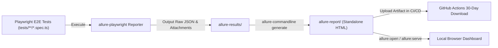
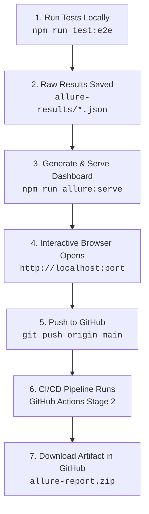

# 📊 Allure Report Integration Guide: Nuvora QA Automation

> **Framework:** Playwright (TypeScript) + Allure Report  
> **Adapter:** `allure-playwright`  
> **CLI Engine:** `allure-commandline`  
> **Target Application:** Nuvora Modern E-Commerce Platform  

---

## 🌟 Overview: What is Allure Report?

While Playwright provides a native HTML report, **Allure Report** is an open-source, multi-language test reporting framework designed for executive-level clarity, deep diagnostics, and behavioral analytics.

In Nuvora, Allure runs concurrently with Playwright's native reporters, producing rich visual dashboards that categorize test runs by **Business Features**, **Epics**, **User Stories**, and **Severity Levels**.

```
┌────────────────────────────────────────────────────────────────────────┐
│                        ALLURE REPORT CAPABILITIES                      │
├──────────────────────┬─────────────────────────────────────────────────┤
│ Executive Dashboard  │ High-level pass/fail rates, durations, defects  │
│ Behaviors Hierarchy  │ Epics ➔ Features ➔ Stories ➔ Scenarios          │
│ Timeline View        │ Visual concurrency and worker thread breakdown  │
│ Categories           │ Automatic classification of product vs test bugs│
│ Historical Trends    │ Flakiness tracking, duration trends over time   │
│ Detailed Steps       │ Step-by-step actions with nested screenshots    │
└──────────────────────┴─────────────────────────────────────────────────┘
```

---

## 🏗️ Architecture & Data Flow



1. **Test Execution:** Tests run via `npm run test:e2e`.
2. **Raw Metadata Collection:** `allure-playwright` writes raw metadata, parameters, steps, and attachments into `allure-results/`.
3. **Report Generation:** `allure-commandline` processes `allure-results/` into a complete, standalone single-page application inside `allure-report/`.
4. **CI/CD Storage:** GitHub Actions archives `allure-report/` on every pipeline run for 30 days.

---

## ⚙️ Configuration Details

### 1. Playwright Configuration (`playwright.config.ts`)
The Allure reporter is registered in the `reporter` array alongside native HTML and JSON reporters:

```typescript
  reporter: [
    ['html', { open: 'never' }],
    ['json', { outputFile: 'playwright-results.json' }],
    ['allure-playwright', { 
      outputFolder: 'allure-results', 
      detail: true 
    }],
  ],
```

### 2. NPM Scripts (`package.json`)
Convenient scripts are available to generate and inspect reports:

```json
"scripts": {
  "test:e2e": "playwright test",
  "allure:generate": "allure generate allure-results --clean -o allure-report",
  "allure:open": "allure open allure-report",
  "allure:serve": "allure serve allure-results"
}
```

---

## 💻 Local Usage Guide

### Prerequisites
To generate or view Allure reports locally, Java JRE (Java 11 or higher) must be installed on your machine (required by the Allure CLI compiler):
- **Windows (winget):** `winget install EclipseAdoptium.Temurin.17.JRE`
- **macOS (brew):** `brew install openjdk@17`
- **Linux:** `sudo apt install default-jre`

*(Note: In GitHub Actions, Java 17 is configured automatically, so no manual installation is needed in CI!)*

### Running Tests & Viewing Reports Locally

1. **Execute Test Suite & Collect Allure Results:**
   ```bash
   npm run test:e2e
   ```
   This executes the 53 Playwright tests and saves test metadata in `allure-results/`.

2. **Instantly Serve the Allure Dashboard in Browser:**
   ```bash
   npm run allure:serve
   ```
   Spins up a local web server and opens the live Allure dashboard in your default browser.

3. **Generate a Static Report Folder:**
   ```bash
   npm run allure:generate
   ```
   Generates a standalone web folder in `allure-report/`.

4. **Open the Generated Static Report:**
   ```bash
   npm run allure:open
   ```

---

## 🔄 Complete End-to-End Example Flow: Start to Finish

Here is the exact start-to-finish workflow demonstrating how a developer or QA engineer writes a test, runs it, generates the Allure dashboard, and inspects the results both locally and in CI/CD:



### Step 1: Execute Tests & Generate Raw Metrics
Run your full test suite or a targeted test file:

```bash
# Run all 53 tests
npm run test:e2e

# Or run a single test spec for fast feedback
npx playwright test tests/customer/home.spec.ts
```

* **What happens behind the scenes:**
  * Playwright executes the test scenarios in headless Chromium.
  * `allure-playwright` captures timestamps, assertion steps, screenshots on failure, and writes raw metadata files into the `allure-results/` directory.

---

### Step 2: Generate and Open the Interactive Dashboard (Local)
To view the report locally:

```bash
# One-command build & live browser preview:
npm run allure:serve
```

* **What happens behind the scenes:**
  * Allure CLI compiles all JSON files in `allure-results/`.
  * A local web server is started on a temporary port.
  * Your default browser opens automatically showing the full interactive dashboard.

* **Alternative (Static build):**
  ```bash
  # Step A: Generate static HTML folder in allure-report/
  npm run allure:generate

  # Step B: Open the generated static report
  npm run allure:open
  ```

---

### Step 3: Exploring the Allure Dashboard Tabs

Once the Allure UI opens in your browser, here is what each tab reveals:

1. **📊 Overview (Executive Summary):**
   - Donut chart with total passed, failed, broken, and skipped tests.
   - Historical duration metrics and execution speeds.
   - Target environment and test framework details.

2. **🏷️ Behaviors (BDD View):**
   - Organizes tests into a business hierarchy: **Epics ➔ Features ➔ User Stories**.
   - Example: `Customer Experience` ➔ `Checkout & Cart` ➔ `Order Placement`.

3. **🗂️ Suites (File & Folder View):**
   - Breaks down tests by physical spec files (`tests/customer/*.spec.ts`, `tests/admin/*.spec.ts`).

4. **⏱️ Timeline (Concurrency & Worker Performance):**
   - Shows horizontal Gantt-chart timeline of worker threads.
   - Reveals which tests ran in parallel and highlights slow-running scenarios.

5. **🚨 Categories (Defect Classification):**
   - Automatically classifies failures into **Product Defects** (e.g. assertion failed, HTTP 500) vs **Test Defects** (e.g. locator timeout, environment setup issue).

6. **📝 Graphs & Trends:**
   - Visual charts showing test status distribution, severity breakdown, and execution durations.

---

### Step 4: The CI/CD Flow (GitHub Actions)

When you push code to GitHub:
```bash
git push origin main
```

1. **Stage 2 (`playwright-tests`)** runs automatically.
2. The pipeline:
   - Executes `npm run test:e2e`.
   - Sets up Java 17 via `actions/setup-java@v4`.
   - Runs `npx allure-commandline generate allure-results --clean -o allure-report`.
   - Packages `allure-report/` into a downloadable zip file (`allure-report`).
3. **Downloading the Report:**
   - Go to your GitHub repo ➔ **Actions** tab ➔ Click your run.
   - Scroll to **Artifacts** ➔ Click **`allure-report`** to download.
   - Unzip and launch it:
     ```bash
     npx allure-commandline open <unzipped-folder>
     # Or using a lightweight HTTP server:
     npx serve <unzipped-folder>
     ```

---

### 📋 Allure Quick Command Cheat Sheet

| Command | Purpose |
| :--- | :--- |
| `npm run test:e2e` | Runs all 53 Playwright E2E tests & records Allure data into `allure-results/` |
| `npm run allure:serve` | Compiles raw data and serves live dashboard in your default browser |
| `npm run allure:generate` | Compiles `allure-results/` into a static `allure-report/` production folder |
| `npm run allure:open` | Launches the pre-compiled `allure-report/` folder in your browser |
| `npx serve allure-report` | Alternative lightweight HTTP server to preview static reports without Java |

---

To take full advantage of Allure's categorization, you can add descriptive metadata to your Playwright tests using `allure-js-commons` or Allure annotations:

### Example: E-Commerce Checkout Test
```typescript
import { test, expect } from '@playwright/test';
import * as allure from 'allure-js-commons';

test.describe('Customer Checkout Flow', () => {
  test('should complete end-to-end purchase with credit card', async ({ page }) => {
    // 🏷️ Categorization Metadata
    await allure.epic('Customer Experience');
    await allure.feature('Checkout & Payments');
    await allure.story('Single-page order placement');
    await allure.severity('critical');
    await allure.owner('QA Automation Team');

    // 📝 Step-by-Step Reporting
    await allure.step('1. Navigate to product details page', async () => {
      await page.goto('/product/1');
      await expect(page.getByTestId('product-title')).toBeVisible();
    });

    await allure.step('2. Add product to shopping cart', async () => {
      await page.getByTestId('add-to-cart-btn').click();
      await expect(page.getByTestId('cart-count-badge')).toHaveText('1');
    });

    await allure.step('3. Fill out shipping address', async () => {
      await page.goto('/checkout');
      await page.getByTestId('checkout-fullname-input').fill('Jane Doe');
      await page.getByTestId('checkout-address-input').fill('123 Market St');
    });

    await allure.step('4. Confirm order placement', async () => {
      await page.getByTestId('place-order-btn').click();
      await expect(page.getByTestId('order-confirmation-container')).toBeVisible();
    });
  });
});
```

---

## 🚀 CI/CD Pipeline Integration (GitHub Actions)

In [`.github/workflows/ci-cd.yml`](file:///.github/workflows/ci-cd.yml), Allure is built into **Stage 2 (`playwright-tests`)**:

```yaml
      # 1. Ensure Java runtime is present
      - name: ☕ Setup Java for Allure Report Generation
        if: always()
        uses: actions/setup-java@v4
        with:
          distribution: 'temurin'
          java-version: '17'

      # 2. Compile raw allure-results into HTML report
      - name: 📈 Generate Allure Interactive HTML Report
        if: always()
        run: npx allure-commandline generate allure-results --clean -o allure-report

      # 3. Upload report as downloadable artifact (30-day retention)
      - name: 📦 Upload Allure HTML Report Artifact
        if: always()
        uses: actions/upload-artifact@v4
        with:
          name: allure-report
          path: allure-report/
          retention-days: 30
```

---

## 📥 How to Download & Inspect Allure Reports from GitHub Actions

1. Go to your repository on GitHub: `https://github.com/pandya-dwip/Nuvora/actions`.
2. Click on the latest workflow run (e.g., Run #13).
3. Scroll down to the **Artifacts** section at the bottom.
4. Download **`allure-report.zip`**.
5. Extract the zip file to your local computer.
6. Run `npx allure-commandline open <extracted-folder>` or serve it with any local static HTTP server (e.g. `npx serve <extracted-folder>`) to browse the full interactive UI!
