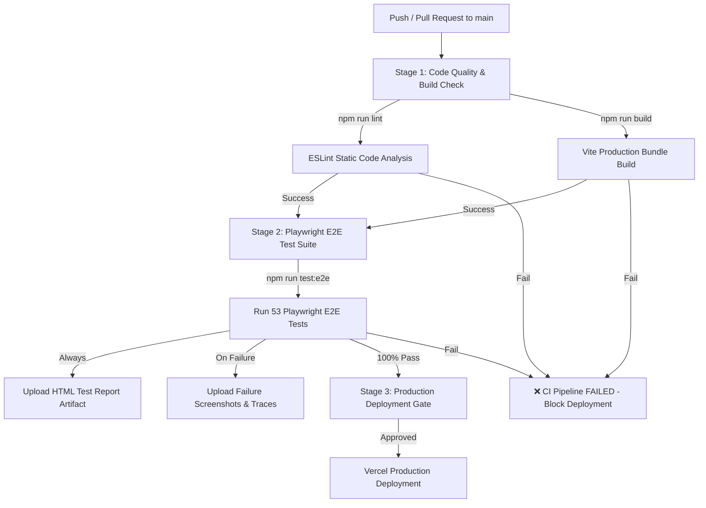

# 🚀 Nuvora CI/CD Pipeline Documentation

This document provides technical documentation for **Nuvora's Automated GitHub Actions CI/CD Pipeline** ([`.github/workflows/ci-cd.yml`](file:///.github/workflows/ci-cd.yml)). It details the multi-stage architecture, code quality validations, automated E2E test reporting, passing boundary policies, and a line-by-line explanation of the GitHub Actions workflow code.

---

## 🏗️ Pipeline Architecture & Job Flow

The Nuvora CI/CD pipeline enforces a **3-Stage Sequential Quality Gate**. Code cannot reach production deployment unless all static analysis, compilation, and automated Playwright E2E tests pass with a **100% success rate**.



---

## 🎯 Pipeline Stages Overview

| Stage | Job Name | Primary Objective | Failure Action |
| :--- | :--- | :--- | :--- |
| **Stage 1** | `code-quality` | Verifies syntax, imports, formatting, and Vite production bundle compilation. | Halts pipeline immediately. Prevents test suite execution on broken code. |
| **Stage 2** | `playwright-tests` | Executes 53 end-to-end browser automation tests across customer and admin user journeys. | Halts pipeline, generates HTML report artifact & failure screenshots. |
| **Stage 3** | `deployment-gate` | Enforces zero-failure quality policy before production release. | Blocks Vercel deployment if any prior stage failed. |

---

## 🔍 Detailed Line-by-Line GitHub Actions Code Walkthrough

Below is the complete breakdown of [`.github/workflows/ci-cd.yml`](file:///.github/workflows/ci-cd.yml), explaining what every line and block does:

### 1. Workflow Header & Event Triggers

```yaml
name: Nuvora CI/CD Pipeline

on:
  push:
    branches: [ main, master ]
  pull_request:
    branches: [ main, master ]
```
- `name`: The title displayed in GitHub's **Actions** tab UI.
- `on`: Specifies event triggers:
  - `push`: Automatically triggers whenever new code is pushed to `main` or `master`.
  - `pull_request`: Automatically triggers when a Pull Request is opened or updated targeting `main` or `master`.

---

### 2. Concurrency Control

```yaml
concurrency:
  group: ${{ github.workflow }}-${{ github.ref }}
  cancel-in-progress: true
```
- `concurrency`: Cancels any older, in-progress pipeline runs if a new commit is pushed to the same branch, saving GitHub Actions build minutes and preventing redundant deployments.

---

### 3. Stage 1: Code Quality & Build Verification (`code-quality`)

```yaml
jobs:
  code-quality:
    name: Code Quality & Build Check
    runs-on: ubuntu-latest
    timeout-minutes: 15

    steps:
      - name: 📥 Checkout repository
        uses: actions/checkout@v4

      - name: 🟢 Setup Node.js environment
        uses: actions/setup-node@v4
        with:
          node-version: lts/*
          cache: 'npm'

      - name: 📦 Install project dependencies
        run: npm ci

      - name: 🔍 Run ESLint static code analysis
        run: npm run lint

      - name: 🏗️ Verify Vite production build compilation
        run: npm run build
```
- `runs-on: ubuntu-latest`: Executes inside a fresh Ubuntu Linux Virtual Machine hosted by GitHub.
- `timeout-minutes: 15`: Safety limit to prevent hung processes from consuming build quota.
- `actions/checkout@v4`: Downloads your project repository code into the runner container.
- `actions/setup-node@v4`: Installs the LTS version of Node.js and enables automatic `npm` package caching for fast dependency installation.
- `npm ci`: Performs clean, deterministic installation of exact package versions listed in `package-lock.json`.
- `npm run lint`: Runs ESLint across all JavaScript/React files to catch syntax errors and undeclared variables.
- `npm run build`: Compiles JSX and CSS modules into optimized production assets in `dist/`.

---

### 4. Stage 2: Playwright Automated E2E Testing (`playwright-tests`)

```yaml
  playwright-tests:
    name: Playwright E2E Test Suite
    needs: [code-quality]
    runs-on: ubuntu-latest
    timeout-minutes: 30

    steps:
      - name: 📥 Checkout repository
        uses: actions/checkout@v4

      - name: 🟢 Setup Node.js environment
        uses: actions/setup-node@v4
        with:
          node-version: lts/*
          cache: 'npm'

      - name: 📦 Install project dependencies
        run: npm ci

      - name: 🎭 Install Playwright Chromium browser & OS dependencies
        run: npx playwright install --with-deps chromium

      - name: 🧪 Execute Playwright E2E test suite
        run: npm run test:e2e
        env:
          CI: true

      - name: 📊 Upload Playwright HTML Test Report
        if: ${{ !cancelled() }}
        uses: actions/upload-artifact@v4
        with:
          name: playwright-report
          path: playwright-report/
          retention-days: 30

      - name: 🖼️ Upload Test Failure Screenshots & Traces
        if: ${{ failure() }}
        uses: actions/upload-artifact@v4
        with:
          name: test-failure-artifacts
          path: test-results/
          retention-days: 14
```
- `needs: [code-quality]`: **Job Dependency Gate**. This job will ONLY execute if `code-quality` passes 100%.
- `npx playwright install --with-deps chromium`: Downloads headless Chromium browser binaries along with required Linux system libraries.
- `npm run test:e2e`: Starts local dev server on port `5180` and executes all 53 Playwright E2E test specs.
- `env: CI: true`: Signals to Playwright that it is running in CI mode (enables forbidden `.only` checks and multi-retry rules).
- `if: ${{ !cancelled() }}`: Uploads the HTML report artifact even if tests failed (as long as the job wasn't manually cancelled).
- `actions/upload-artifact@v4`: Packages `playwright-report/` into a downloadable zip stored on GitHub Actions for 30 days.
- `if: ${{ failure() }}`: Uploads `test-results/` (containing failure screenshots, DOM snapshots, and video recordings) only when a test fails.

---

### 5. Stage 3: Passing Boundary & Deployment Gate (`deployment-gate`)

```yaml
  deployment-gate:
    name: Production Deployment Quality Gate
    needs: [code-quality, playwright-tests]
    runs-on: ubuntu-latest
    timeout-minutes: 5

    steps:
      - name: ✅ Confirm Zero-Failure Passing Boundary
        run: |
          echo "========================================================"
          echo "🎉 All Code Quality & E2E Test Automation Gates PASSED!"
          echo "========================================================"
          echo "✔ Stage 1: ESLint static analysis & Vite build succeeded."
          echo "✔ Stage 2: 53/53 Playwright E2E test scenarios passed."
          echo "✔ Code is verified and approved for Vercel production deployment."
          echo "========================================================"
```
- `needs: [code-quality, playwright-tests]`: Requires **both prior stages** to complete successfully.
- If any lint check, build error, or single Playwright test fails, Stage 3 is blocked and Vercel production deployment is halted.

---

## 📊 Test Report Artifact Retrieval & Debugging

When a pipeline run completes in GitHub Actions:

1. Navigating to the **Actions** tab on your GitHub repository.
2. Select the specific workflow run.
3. Scroll down to the **Artifacts** section at the bottom of the page:
   - **`playwright-report`**: Download and extract the zip file, then open `index.html` in any browser to inspect full interactive test results.
   - **`test-failure-artifacts`**: (Only present on test failures) Contains screenshot images (`.png`), Playwright execution trace files (`.zip`), and video recordings (`.webm`).

---

## 🌐 Vercel Production Deployment Integration

Vercel connects directly to your GitHub repository (`pandya-dwip/Nuvora`):

1. **Vercel Build Protection**: Vercel monitors GitHub commit statuses.
2. When the GitHub Actions CI pipeline passes all 3 stages, GitHub reports a `success` status check to Vercel.
3. Vercel automatically deploys the verified commit to `https://nuvora.vercel.app`.
4. If CI fails, Vercel prevents production deployment, protecting live users from regressions.
